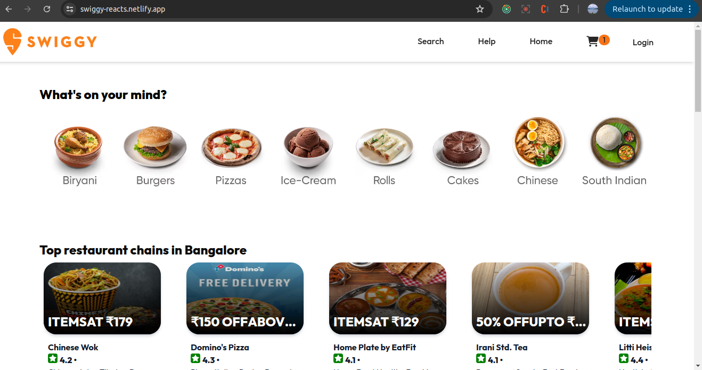
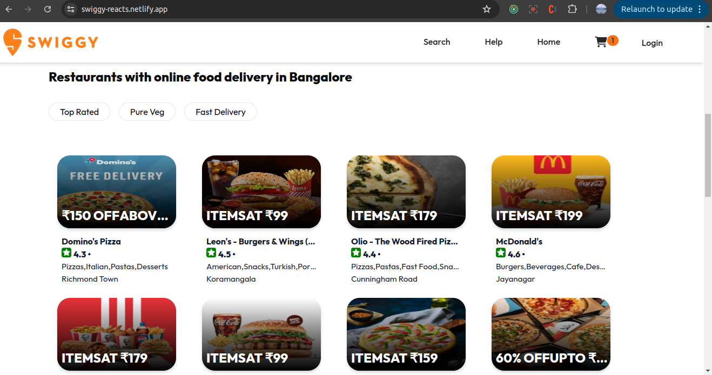
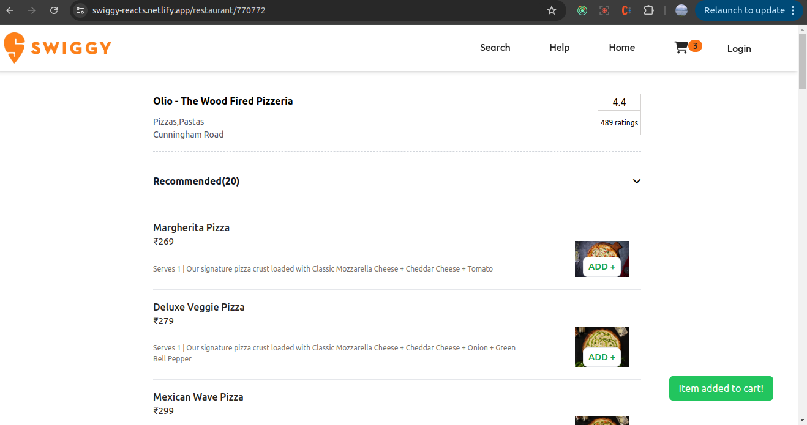
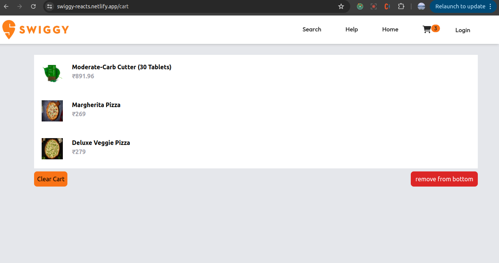

# Food Ordering App

Screenshots

# Food Ordering App

-Header
  -logo
  -nav items
- Body
    -Search
    -Restaurent Card
        -image
        -Restrauent name,-star rating,food  items,time of delivery

        
-footer
    -copyright
    -Links
    -Address
    -Contact

    Two Types of EXport/Import

    -Default Export/Import

    export default Component;
    import Component from path;

    -named Export/Import

    export const component;
    import {Component} from "path";

## React Hooks

They are normal Javascript function(normal js utility function)

written by facebook developers

2 important reacr hooks
-useState()-superpowerful state variables in react
-useEffect()

## Redux Toolkits

-Install @reduxjs/toolkit and react-redux (These are tw o libraries we install)
 --npm install @reduxjs/toolkit
 --npm i react-redux
-Connect our store to our app 
-create slice (cart slice) to add items to cart
- dispatch(action)
-selector

##  setting up testing in our app

-install  react testing library

npm install -D @testing-library/react

-install jest(jest website)

npm install -D  jest

-install Babel dependencies(jest website-using babel)

npm install --save-dev babel-jest @babel/core @babel/preset-env

-configure babel

babel.config.js(@root level)
>>>>
module.exports = {
  presets: [['@babel/preset-env', {targets: {node: 'current'}}]],
};

-configure parcel config file to disable default  babel transpilation

(parcel website => javascript => babel)

create .parcelrc file
>>>>
{
  "extends": "@parcel/config-default",
  "transformers": {
    "*.{js,mjs,jsx,cjs,ts,tsx}": [
      "@parcel/transformer-js",
      "@parcel/transformer-react-refresh-wrap"
    ]
  }
}

- jest configuration

npx jest --init

-install jsdom library

React Testing Library => setup => jest28

npm install -D jest-environment-jsdom

-install @babel/preset-react => to make JSX to work in test cases

npm i -D @babel/preset-react

-include @babel/preset-react  inside my babel.config.js

-install a library for toBeInTheDocument

npm i -D @testing-library/jest-dom

